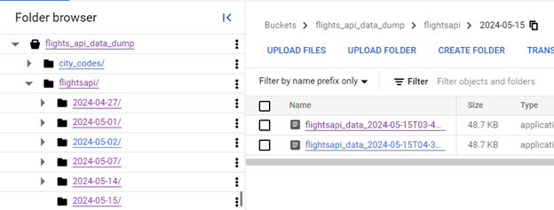

# INST767 Project: Hotel, Flight, and Weather Availability Data Pipeline
### Group 3: Anushka Chougule, Asmita Samantha, David Wang, Rajeevan Madabushi, Vijay Arni

## Introduction
For our project, we focused on creating a data pipeline to check hotel availability by using various APIs. Our project includes four main steps: ingestion, transformation, storage, and analysis, all done using Google Cloud. We used the Flights API to get flight information, the Weather API to get current weather conditions, and the Hotels API to check for hotels in the city. The data from these APIs is collected (ingestion)(cloud Functions), cleaned and organized (transformation)(DataProc), stored in Google Cloud (storage), and then analyzed to provide useful information to travelers (BigQuery).

## Data Sources
For this project, we have used three main API Sources.
<h3> 
  <b>Hotels</b>(https://rapidapi.com/DataCrawler/api/tripadvisor16) 
   </h3>
<h4>Endpoint 1: /v1/hotels/searchLocation 
Description:This endpoint to get the geoId which we used in our search hotels endpoint. 
Endpoint 2:/v1/hotels/searchHotels
Description:This gives us the details of the hotels.</h4>

<h3><b>Flights</b>(http://api.aviationstack.com/documentation)  </h3>
<h4>Endpoint 1: v1/flights 
Description: We used the endpoint to get real-time flight data which includes departure and arrival times in cities and schedules. 
<h3><b>Weather</b>(https://weatherstack.com/documentation) </h3>
<h4>Endpoint1: /current?access_key=YOUR_ACCESS_KEY&query={city} (Replace {city} with the name of the city.
Description: We used the endpoint for multiple cities to get real-time information of those cities. </h4>
    
## Data Pipeline Overview 

  

## Ingestion
In this step, we used three different Cloud Functions to fetch data from various open-source APIs. Each Cloud Function stores the retrieved data in its own intermediate Google Cloud Storage Bucket as .csv files. We use the Flights API, Weather API, and Hotels API to gather the data needed for our project.

  

The following is our Google Cloud Functions with a summary of
their API source and code:

1. [**Cloud_Functions/cityFunFlight.py**](https://github.com/MSNRajeevan/BigDataInfrastructure/blob/main/api_Ingest/flightAPIFetchData.py):
    Pulling data from the Flight API source, this returns all the flight information (flight_date, flight_status, departure, arrival, timezone, iata, icao, terminal, gate, delay, scheduled, estimated, actual, estimated_runway, actual_runway). Then, we were missing the city name field, which we needed to query in big query at the end of our analysis. So, we created a new bucket that contains all the iata codes and their respective city names. Using this, we have added the arrival_city and departure_city fields to the data. The bucket that has the dataset that has the iata codes and their respective city names is located here: [flights_api_data_dump/city_codes/airports-code@public.xlsx]

  

    
  

  All the resultant data is stored in the bucket: [flights_api_data_dump/weatherapi] in its respective date folder.

  

    
  

2. [**Cloud_Functions/weatherAPIFetchData.py**](https://github.com/MSNRajeevan/BigDataInfrastructure/blob/main/api_Ingest/weatherAPIcloudFunction.py): Pulling data from the Weather API source, this returns detailed weather information. The request includes query(cities). The weather information including city name, country, region, latitude, longitude, timezone_id, localtime, localtime_epoch, and utc_offset. The current weather data includes observation_time, temperature, weather_code, weather_descriptions, wind_speed, wind_degree, wind_dir, pressure, precipitation, humidity, cloudcover, feelslike, uv_index, visibility, and is_day. It stores the data in the bigdatadump-apitobq/weatherapi bucket

  

    
  

3. [**Cloud_Functions/hotelsapidatafetch.py**](https://github.com/MSNRajeevan/BigDataInfrastructure/blob/main/api_Ingest/Hotels_API_Cloud_Function.py): Pulling data from the Hotel API source, this returns comprehensive hotel information including hotel_city, hotel_id, ratings_count, rating, provider, price, city, and additional details. It stores the data in the hotel_api_data_dump bucket.
    
    

      
    

4. [**Cloud_Functions/allapisfetchFun.py**](https://github.com/MSNRajeevan/BigDataInfrastructure/blob/main/api_Ingest/AllAPIFetchFinal.py):
In an ideal scenario, we would have unlimited api calls which would let us query for all the cities for weather and hotel or many cities that we are interested inand all the data that is returned from the flight api must contain the records in the weather api and hotels api based on the arrival_city and departure_city. But sadly, since the apis are all on basic plans, it will only return a few records from the flights api which may or may not have results from the weather and hotels api. So for the scope of this project, in addition to calling all the apis, and using the data from just the data we get from flights, we also created one new function that will get the top 6 cities, based on the arrival and departure city from the flight data and use these cities to fetch the data from weather and hotels api, hence avoiding us to manually enter a lot of cities as queries for both hotels and weather api. We have also scheduled this new function which will fetch data every 4 hours and store the data from all the apis to their respective buckets and leave the files there to be picked up by the dataproc jobs.

  

    
  

  From here, we set up individual Cloud Schedulers for each of these Functions, which each have their own set timeframes. Once these schedulers are run, they overwrite the existing .csv file in the given bucket with the new data in the same filename. Below shows evidence of the Schedulers working for each of the assigned Functions:

  

    
  

  - Flight Data Function: The scheduler triggers fetch_flight_data.py at the designated interval, updating the flight_data bucket with the latest flight information.
    This scheduler is set to run every 4 hours EST, fetching the latest flight information and updating the flight data bucket.

    

      
    

    
  - Weather Data Function: The scheduler triggers fetch_weather_data.py at the designated interval, updating the weather_data bucket with the latest weather information.
    This scheduler is set to run every 4 hours EST, fetching the latest weather information and updating the weather data bucket.

    

      
    

    
  - Hotel Data Function: The scheduler triggers fetch_hotel_data.py at the designated interval, updating the hotel_data bucket with the latest hotel information.
    This scheduler is set to run every 4 hours EST, fetching hotel availability information for the next day and updating the hotel data bucket.

    

      
    

## Transformation
For the next step of our pipeline, we created a controlled Dataproc Workflow that contains multiple jobs to clean the various datasets using PySpark from the buckets and send them as various tables to BigQuery. Once the workflow starts, it creates a new cluster for each job, runs the respective jobs, clears the processed files from the storage buckets, archives them to their respective archive buckets we created, and stores the processed data in the respective tables in Bigquery.  We have all our Dataproc jobs in the staging area and here is a screenshot of our staging area:

  

    
  

We designed a Workflow template with multiple independent jobs of data cleaning, detailed as follows:

[Flights DataProc ](https://github.com/MSNRajeevan/BigDataInfrastructure/blob/main/DataProc/Flights_DataProc.py): 
This job cleans the flight data into an organized table. Tasks include reading the data from its bucket, selecting the necessary columns, setting the correct data types, and sending the cleaned data to BigQuery table under the name *flightsTable*.

  

    
  

[Weather DataProc ](https://github.com/MSNRajeevan/BigDataInfrastructure/blob/main/DataProc/Flights_DataProc.py):
 This job cleans the weather data into an organized table. Tasks include reading the data from its bucket, selecting the necessary columns, setting the correct data types, and sending the cleaned data to BigQuery  table under the name *weatherTable*.

[Hotels DataProc ](https://github.com/MSNRajeevan/BigDataInfrastructure/blob/main/DataProc/hotelsDataProcJob.py): 
This job cleans the hotel data into an organized table. Tasks include reading the data from its bucket, selecting the necessary columns, setting the correct data types, and sending the cleaned data to BigQuery table under the name *hotelsTable*.

  

    
  

Here is an image showing the Bigquery table that is updated according to our scheduled run:

  

    
  

To automate this process, we set up a Cloud Scheduler to call this Dataproc Workflow. The hotels and weather workflows are scheduled to run every  9  and a half hours every day and flights run every 9 hours 40 minutes since only 2 active clusters from the same region can be running at the same time. As shown here:

  

    
  

## Storage
For the storage component of our project, we leveraged BigQuery. As outlined in the previous step, each PySpark job concluded by sending/writing the DataFrames into BigQuery. We created a dataset named “scenic-style-420014.BigData767: and stored all three tables within it. These three unique entities were selected as they each represent distinct categories with specific information. This setup allows us to JOIN the tables together for analysis whenever necessary.

Here is a screenshot of all the tables stored within the dataset, which appeared once the Dataproc Workflow with various jobs was successfully completed.

Three Entities in BigQuery Dataset

      
    

Preview of the **flight_data Table**:

      
    

Preview of the **weather_data Table**:

      
    

Preview of the **hotel_data Table**:

      
    

## Analysis
- **Question 1**: How does a significant drop in atmospheric pressure at arrival airports affect flight arrival delays and impact the availability and ratings of hotels in the corresponding destination cities? (Assuming low pressure is below standard atmospheric pressure at sea level)

  The query to address this question was from [**Query 1**](./sqlQuery/Query_1.sql). 

  

- **Question 2**: How does day type affect hotel choices in cities where flights arrive? Do people prefer quieter hotels when it's day and more livelier hotels when it's night?

  The query to address this question was from [**Query 2**](./sqlQuery/Query_2.sql). 

  

- **Question 3**: For days with lower temperature at arrival airports, what are the corresponding flight delays and the hotel availability in the destination city? Is it that cold weather causes more delays or increases the hotel prices due to more demand in the arrival city?

  The query to address this question was from [**Query 3**](./sqlQuery/Query_3.sql). 

  

- **Question 4**: Promoting hotels to travelers with potential prolonged delay at departure airport: On days with poor visibility (visibility_km < 1) at departure city, which flights are delayed for more than 3 hours? What are the best-rated hotels in their depature cities (according to rating) and their relevent info: nightly rates (price), provider and url (external_url)?

  The query to address this question was from [**Query 4**](./sqlQuery/queryDelaysVisibility.sql). 

  

- **Question 5**: Promoting high quality hotels to travelers at locations where they might prefer to spend more time indoor (with high UV index or rainy): Which flights are landing in cities with high UV index (ux_index>6) or rainy? What are the available top rated hotel options? What's their relevent info: nightly rates (price), provider and url (external_url)?

  The query to address this question was from [**Query 5**](./sqlQuery/queryIndoor.sql). 

  

- **Question 6**: Promoting travel package to sunny cities: Which flights are traveling to sunny cities? What are the available top rated hotel options at the city? What's their relevent info: nightly rates (price), provider and url (external_url)?

  The query to address this question was from [**Query 6**](./sqlQuery/queryGoodWeather.sql). 

  

- **Question 7**: For each city pair based on flight routes, what are all the available hotels in the destination cities, sorted by price in ascending order, along with their ratings and the frequency of flights between these cities?

  The query to address this question was from [**Query 7**](./sqlQuery/query7.sql). 

  

- **Question 8**: What are the average flight delays and hotel ratings for each departure city, considering the local weather conditions such as rain or UV index greater than zero?

  The query to address this question was from [**Query 8**](./sqlQuery/query8.sql). 

  

- **Question 9**: For cities experiencing cooler temperatures (below 21°C), which flights are arriving, and what are the top-rated hotels in these cities, along with their details like price and provider?

  The query to address this question was from [**Query 9**](./sqlQuery/query9.sql). 

  

- **Question 10**: What are the available hotels in the destination cities of all flight routes, sorted by price in ascending order, along with their titles, ratings, and the frequency of flights between these cities?

  The query to address this question was from [**Query 10**](./sqlQuery/query10.sql).  

  

