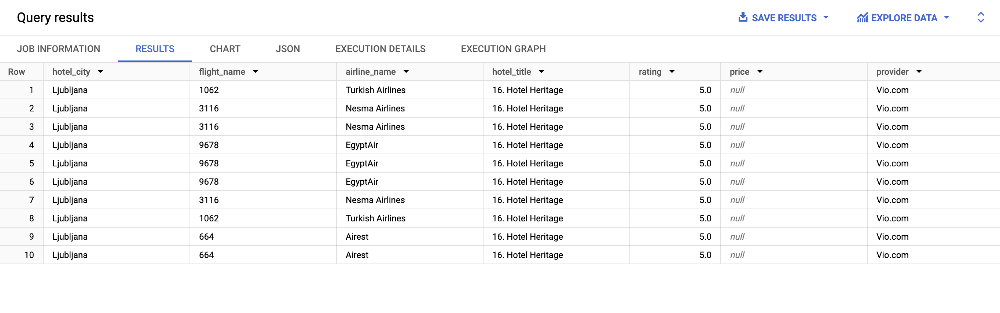

# INST767 Project: Hotel, Flight, and Weather Availability Data Pipeline
### Group 3: Anushka Chougule, Asmita Samantha, David Wang, Rajeevan Madabushi, Vijay Arni

## Introduction
For our project, we focused on creating a data pipeline to check hotel availability by using various APIs. Our project includes four main steps: ingestion, transformation, storage, and analysis, all done using Google Cloud. We used the Flights API to get flight information, the Weather API to get current weather conditions, and the Hotels API to check for hotels in the city. The data from these APIs is collected (ingestion)(cloud Functions), cleaned and organized (transformation)(DataProc), stored in Google Cloud (storage), and then analyzed to provide useful information to travelers (BigQuery).

## Pipeline
...

## Ingestion
In this step, we used three different Cloud Functions to fetch data from various open-source APIs. Each Cloud Function stores the retrieved data in its own intermediate Google Cloud Storage Bucket as .csv files. We use the Flights API, Weather API, and Hotels API to gather the data needed for our project.

## Transformation
...

## Storage
...

## Analysis
- **Question 1**: How does a significant drop in atmospheric pressure at arrival airports affect flight arrival delays and impact the availability and ratings of hotels in the corresponding destination cities? (Assuming low pressure is below standard atmospheric pressure at sea level)

  The query to address this question was from [**Query 1**](./sqlQuery/Query_1.sql). 

  

- **Question 2**: How does day type affect hotel choices in cities where flights arrive? Do people prefer quieter hotels when it's day and more livelier hotels when it's night?

  The query to address this question was from [**Query 2**](./sqlQuery/Query_2.sql). 

  

- **Question 3**: For days with lower temperature at arrival airports, what are the corresponding flight delays and the hotel availability in the destination city? Is it that cold weather causes more delays or increases the hotel prices due to more demand in the arrival city?

  The query to address this question was from [**Query 3**](./sqlQuery/Query_3.sql). 

  

- **Question 4**: Promoting hotels to travelers with potential prolonged delay at departure airport: On days with poor visibility (visibility_km < 1) at departure city, which flights are delayed for more than 3 hours? What are the best-rated hotels in their depature cities (according to rating) and their relevent info: nightly rates (price), provider and url (external_url)?

  The query to address this question was from [**Query 4**](./sqlQuery/queryDelaysVisibility.sql). 

  

- **Question 5**: Promoting high quality hotels to travelers at locations where they might prefer to spend more time indoor (with high UV index or rainy): Which flights are landing in cities with high UV index (ux_index>6) or rainy? What are the available top rated hotel options? What's their relevent info: nightly rates (price), provider and url (external_url)?

  The query to address this question was from [**Query 5**](./sqlQuery/queryIndoor.sql). 

  

- **Question 6**: Promoting travel package to sunny cities: Which flights are traveling to sunny cities? What are the available top rated hotel options at the city? What's their relevent info: nightly rates (price), provider and url (external_url)?

  The query to address this question was from [**Query 6**](./sqlQuery/queryGoodWeather.sql). 

  

- **Question 7**: For each city pair based on flight routes, what are all the available hotels in the destination cities, sorted by price in ascending order, along with their ratings and the frequency of flights between these cities?

  The query to address this question was from [**Query 7**](./sqlQuery/query7.sql). 

  

- **Question 8**: What are the average flight delays and hotel ratings for each departure city, considering the local weather conditions such as rain or UV index greater than zero?

  The query to address this question was from [**Query 8**](./sqlQuery/query8.sql). 

  

- **Question 9**: For cities experiencing cooler temperatures (below 21°C), which flights are arriving, and what are the top-rated hotels in these cities, along with their details like price and provider?

  The query to address this question was from [**Query 9**](./sqlQuery/query9.sql). 

  

- **Question 10**: What are the available hotels in the destination cities of all flight routes, sorted by price in ascending order, along with their titles, ratings, and the frequency of flights between these cities?

  The query to address this question was from [**Query 10**](./sqlQuery/query10.sql).  

  

